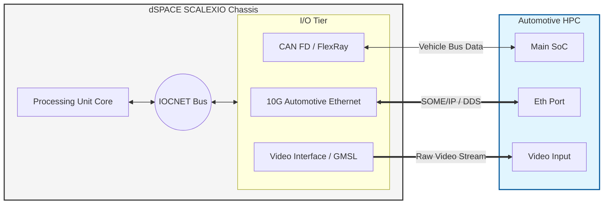
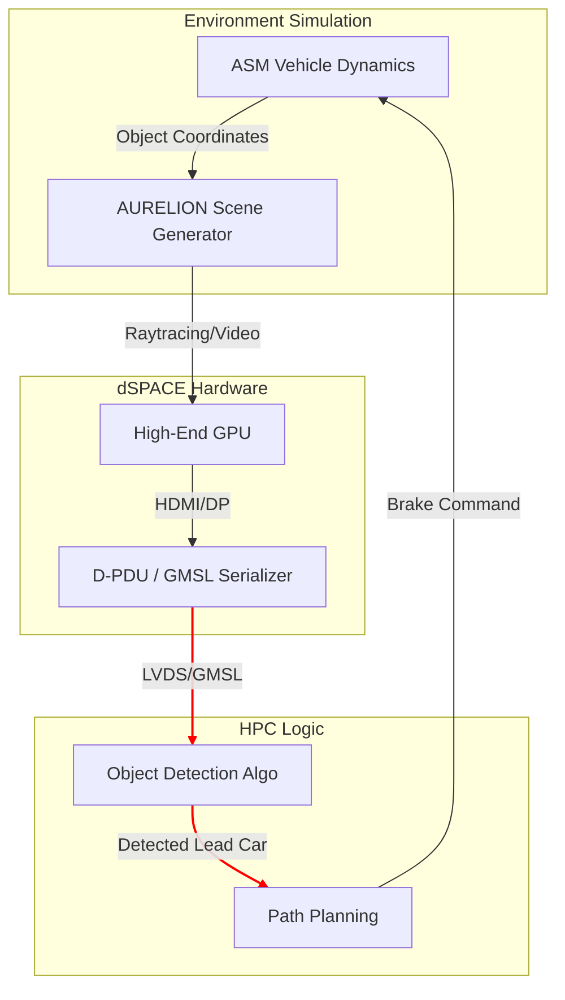
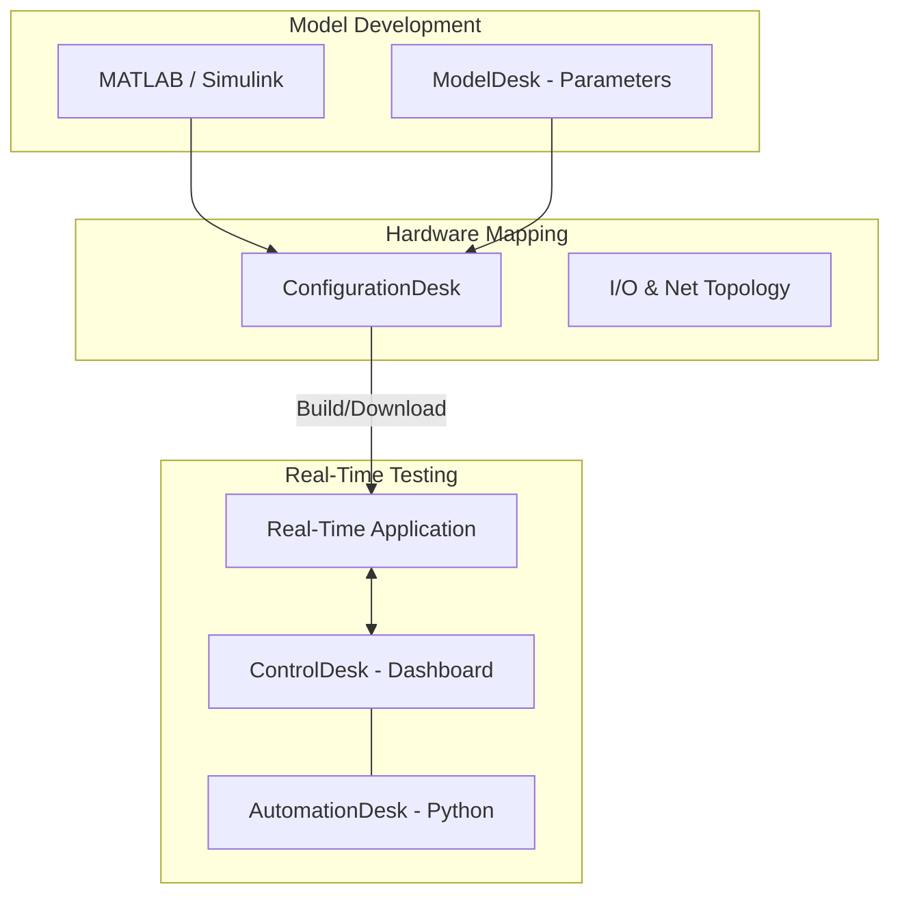
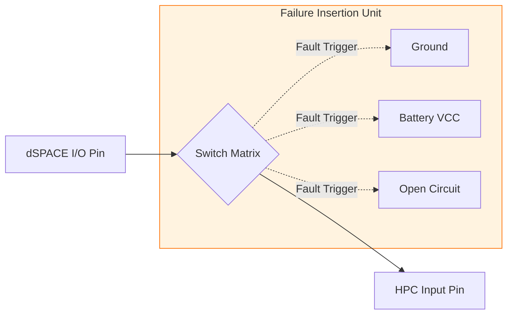
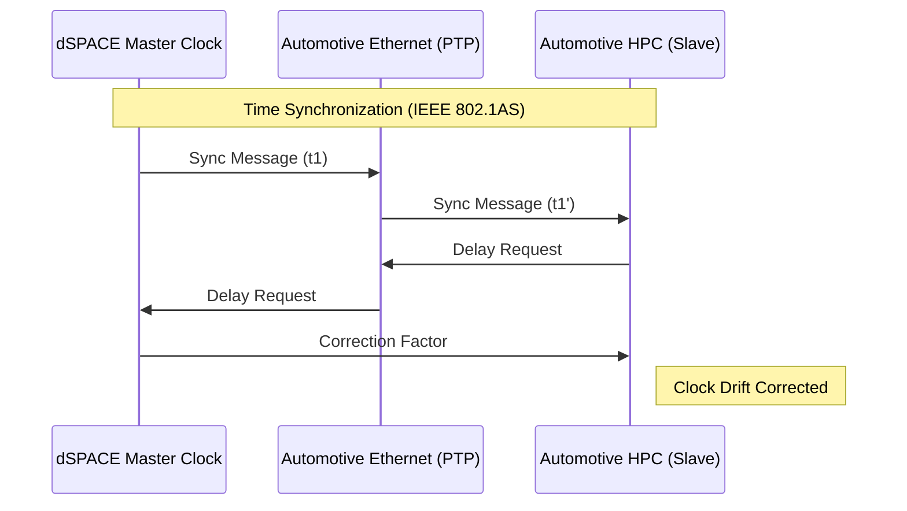
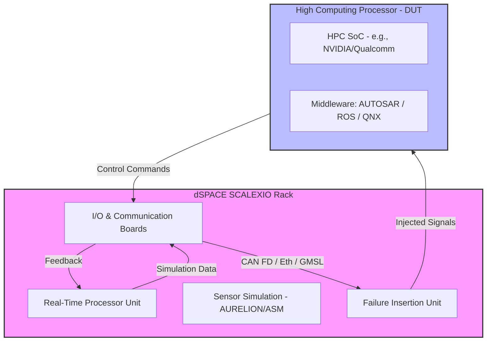

# Questions regarding the dSpace system

Need more details about the "SCALEXIO Rack System" mentioned in the PPT. 
- Exact details of SCALEXIO Rack System used in the existing gHiL system.
- Since we are talking about the dSpace system. We need Matlab/Simulink Vehicle models
    - Who will provide the Matlab/Simulink vehicle models?
- How are we going to simulate the environments?
  - Replaying the sensor and/or video data? (What tools are used to replay the data?)
  - Synthetic data simulation from the dspace? (Details about how these data is fed into the ADAS subsystems?)

# Hardware Architecture (Topology)

[GMSL](https://www.google.com/search?q=GMSL&sourceid=chrome&ie=UTF-8#:~:text=mistakes.%20Learn%20more-,Gigabit%20Multimedia%20Serial%20Link,-Wikipedia)   
[IOCNET (I/O Carrier Network)](https://www.dspace.com/en/pub/home/products/hw/simulator_hardware/scalexio/scalexio_iocnet.cfm)    

# Sensor data injection

# SW Stack and toolchains

# Electrical fault simulation

# Latency and sync

# Run1

